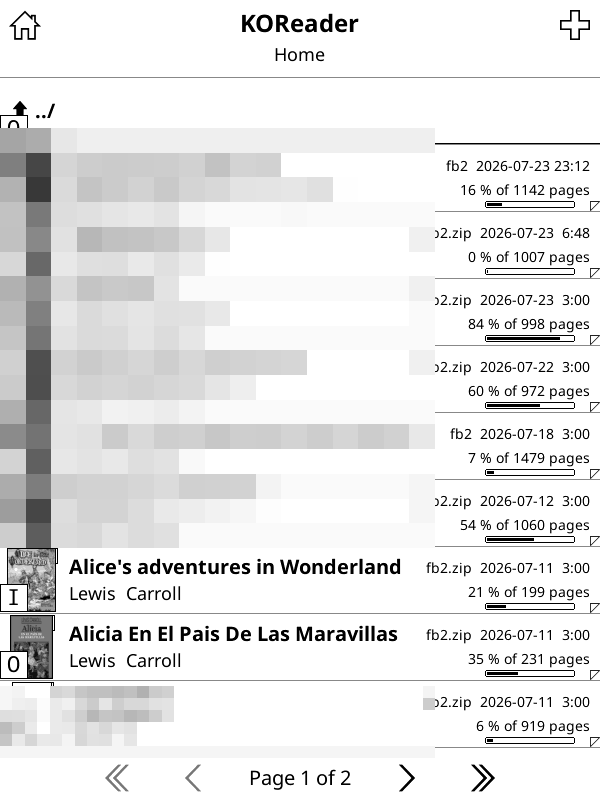

# KOReader user patches

Drop-in [user patches](https://github.com/koreader/koreader/wiki/User-patches) for KOReader.

Install by copying a file into `koreader/patches/` on the device and restarting KOReader,
or through [`appstore.koplugin`](https://github.com/omer-faruq/appstore.koplugin).

The leading number is the patch priority: `1-` runs early during startup, `2-` runs once
`UIManager` is ready. A patch that throws is caught and logged — it cannot stop KOReader
from starting.

---

## `1-kindle-unblock-sigalrm.lua`

Unblock `SIGALRM` that a third-party launcher left blocked in KOReader's signal mask.

### Symptoms it fixes

* **Synchronize time** never finishes. The *"Synchronizing time. This may take several
  seconds."* message stays on screen and KOReader stops responding to input for good — on a
  non-touch device the only way out is a power cycle.
* **Show network info** hangs in the same way.
* In general: any menu entry that shells out to a network CLI tool can freeze the UI, because
  the tool never returns.

### When it is useful

On a **Kindle where KOReader is launched by a third-party hotkey launcher**. The known case is
[`launchpad`](https://www.mobileread.com/forums/showthread.php?t=97636), h1uke's hotkey manager
for the Kindle 3 / DX generation, but anything that leaves `SIGALRM` blocked has the same effect.

If you start KOReader from KUAL or from the Kindle framework, you are most likely unaffected —
and then this patch does nothing at all.

### Why it happens

`launchpad` arms an interval timer to time out hotkey sequences (its README: *"engages the
interval timer to trigger after specified HotInterval milliseconds"*), which means it blocks
`SIGALRM` while it runs. It does not restore the signal mask before `exec`'ing the program the
hotkey launches.

A signal mask is inherited across `fork()` and **preserved across `execve()`**, so the block
propagates silently into KOReader and then into every helper KOReader spawns. The helper cannot
detect it and cannot undo it.

That breaks every CLI tool that implements its timeouts with `alarm()` / `setitimer()`:

| tool | used by | behaviour with `SIGALRM` blocked |
| --- | --- | --- |
| `ntpdate` | Synchronize time | sends one request, then waits forever — its own `-t` option is implemented via `SIGALRM` too, so it does not help |
| `ping` | Show network info | sends the first packet and never sends another |

The alarm is raised but, being blocked, only becomes *pending* — visible as bit 14 set in both
`SigBlk` and `ShdPnd` in `/proc/<pid>/status`. It is never delivered, so the helper never
returns and a synchronous `os.execute()` hangs the UI.

Upgrading the launcher is not a way out: the newest package, `launchpad 0.0.1d` (2015-09-11), is
a repackaging that still ships the February 2011 binary — which is why an up-to-date install
still reports itself as `0.0.1c`. Unpacking the package and comparing checksums against the
installed binary confirms they are the same file.

### What the patch does

Reads its own `SigBlk`; if `SIGALRM` is blocked, calls `sigprocmask(SIG_UNBLOCK, …)` once, early
in startup. The corrected mask is then inherited by everything KOReader spawns afterwards, so
one call fixes every helper.

It is a **no-op unless the signal really is blocked**, which makes it safe to keep installed on
any device and any platform.

### Verifying

After restarting KOReader, `crash.log` should contain:

```
unblock-sigalrm: SIGALRM was blocked by the launcher, unblocked it
```

and the reader process should show a clear mask:

```
# grep SigBlk /proc/$(pidof reader.lua)/status
SigBlk:	0000000000000000
```

With the patch in place, **Synchronize time** does not merely stop freezing — it starts working.

### Note

This is not really a KOReader bug: the launcher is what leaks the blocked mask. KOReader is
simply the program that suffers most from it, because it shells out to these tools from its UI
thread. The patch is a cheap defensive measure on the victim's side.

---

## `2-coverbrowser-list-progressbar.lua`

Adds a reading-progress bar to every book row of the CoverBrowser **detailed list** view,
underneath the `… % of … pages` text, bottom-right, clear of the dog-ear corner.



The bar has a **fixed width and the same horizontal position in every row**, so the fill level
can be compared between books at a glance. The numeric text is kept. Styling matches the reader's
own bottom progress bar (border plus fill); a finished book shows a full bar, an abandoned one is
greyed out.

Stock KOReader only draws progress in the *mosaic* view (`show_progress_in_mosaic`), never in the
list view.

---

## `2-thicker-focus-underline.lua`

Makes the focus underline — the bar that marks the row the d-pad is standing on — thick enough
to see on an old eInk screen, **without thickening the separators between rows**.

KOReader paints both with the same widget: every menu item ends in an `UnderlineContainer`, drawn
in `line_color` normally and in black while the item holds the focus. At 167 dpi the stock line is
1 px in `Menu` and 1.5 px elsewhere, which on a Pearl screen is barely distinguishable from the
separator above it.

Raising the size alone would fatten the separators too, so the patch instead has the container
**reserve** the thick line's height while **painting** a thin one until the item is focused. The
height never changes, so nothing reflows — which is what upstream ran into when it tried to swap
the size in `MenuItem:onFocus` (see the commented-out attempt there) and backed the change out.

Focused rows are drawn with `Size.line.focus_indicator`, KOReader's own "this is focused"
thickness — the same one the CoverBrowser mosaic view already uses, and close to the bar the
native Kindle UI puts under the selected row.

Covers `Menu` (file browser, history, OPDS catalogs, plugin lists), `TouchMenuItem` and
`ConfigDialog`. No-op on devices without a d-pad (`Device:hasDPad()`), where nothing walks a focus.

---

## `2-triple-shift-screenshot.lua`

Takes a screenshot when **Shift is tapped three times** in a row, the way the stock Kindle
interface does it. Keyboard devices only (`Device:hasKeyboard()`).

KOReader's own shortcut is `Alt` + `Shift` + `G` — three keys at once, two of them on opposite
sides of a Kindle Keyboard. Three taps of a single key need one finger and about a second.

A *tap* is a press and release of Shift with nothing in between: any other key going down, any
modifier already held at press time, and any key repeat (a held Shift) all clear the count. So
`Shift` + `Home`, `Shift` + page-turn and capital letters keep working — verified on a Kindle 3.
Three taps within 1.5 s send the standard `Screenshot` event, the same one the Dispatcher action
sends, so the file lands in the usual place.

Key events cannot express this in settings: KOReader binds *chords* (`{"Alt", "Shift", "G"}`), it
has no notion of a key tapped N times, and a bare modifier press never reaches a widget — the
input layer swallows it (`frontend/device/input.lua`, "handle modifier keys"). Hence a patch that
wraps `Input:handleKeyBoardEv`.
